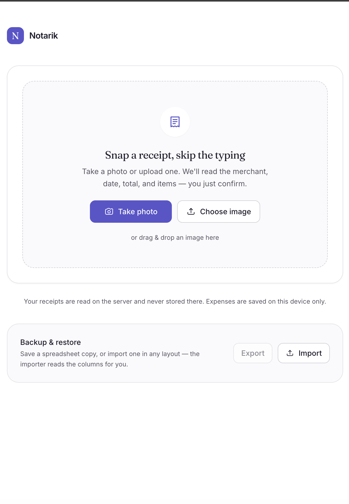
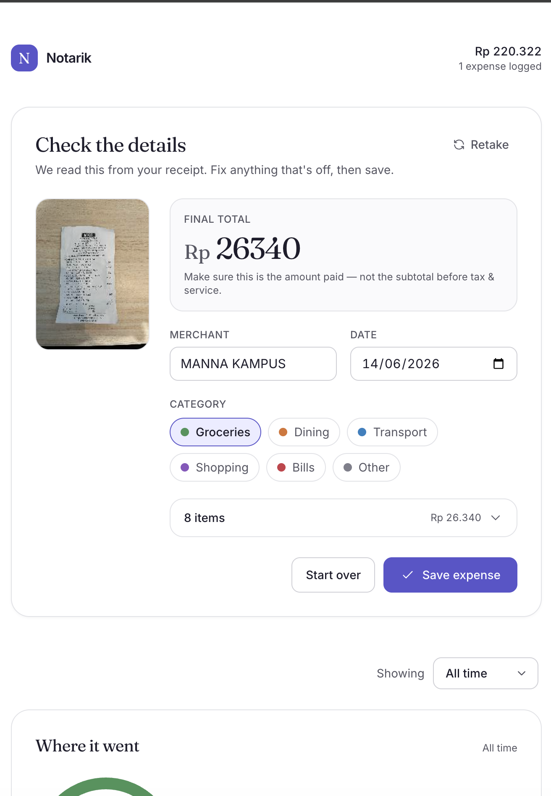
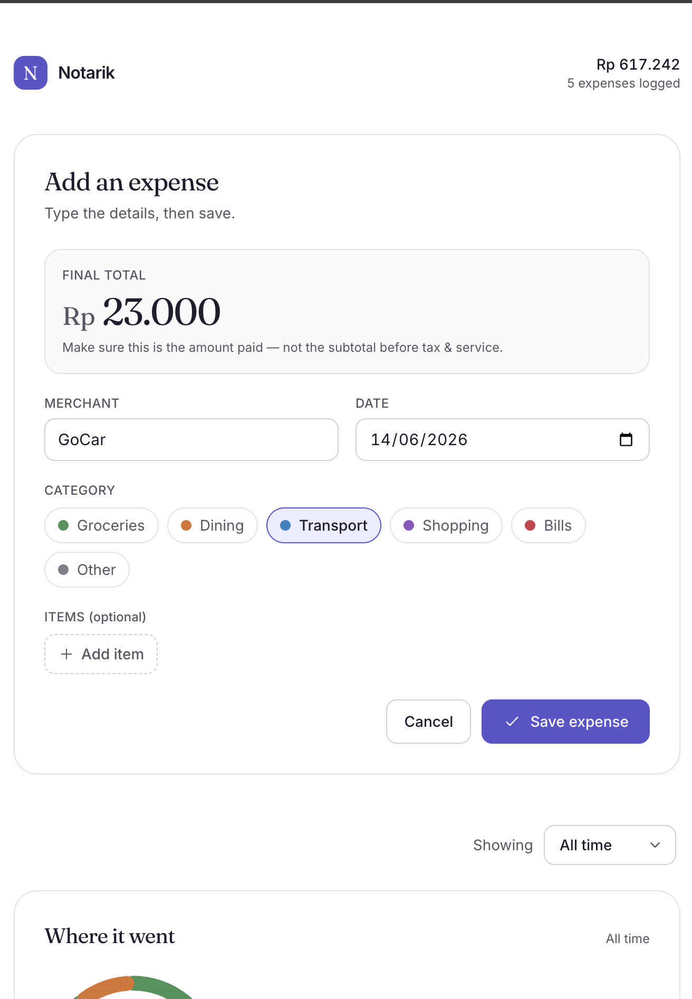
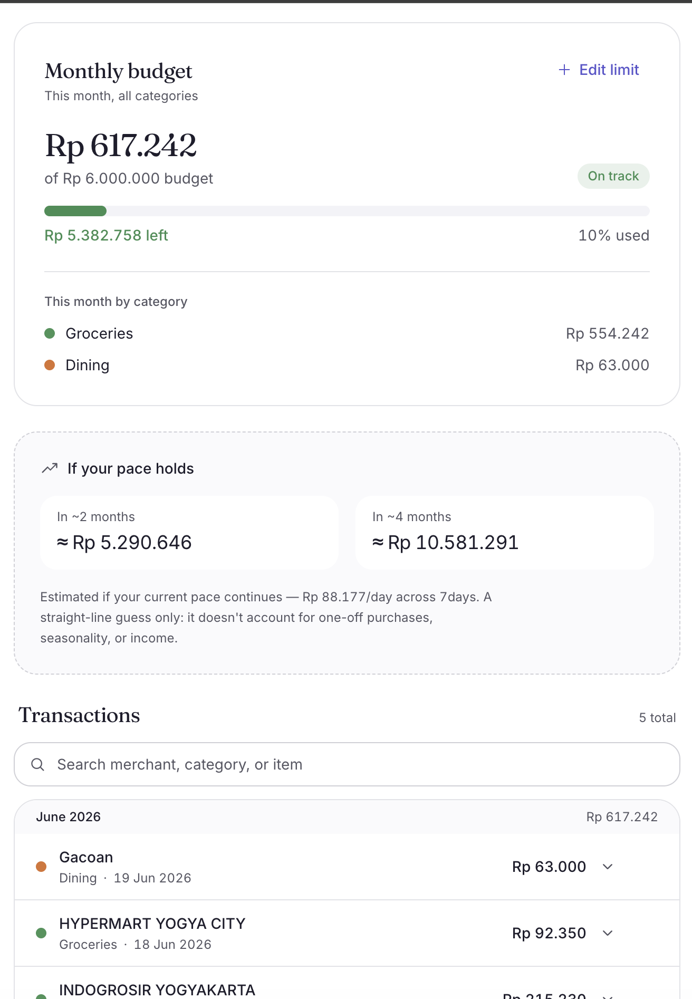
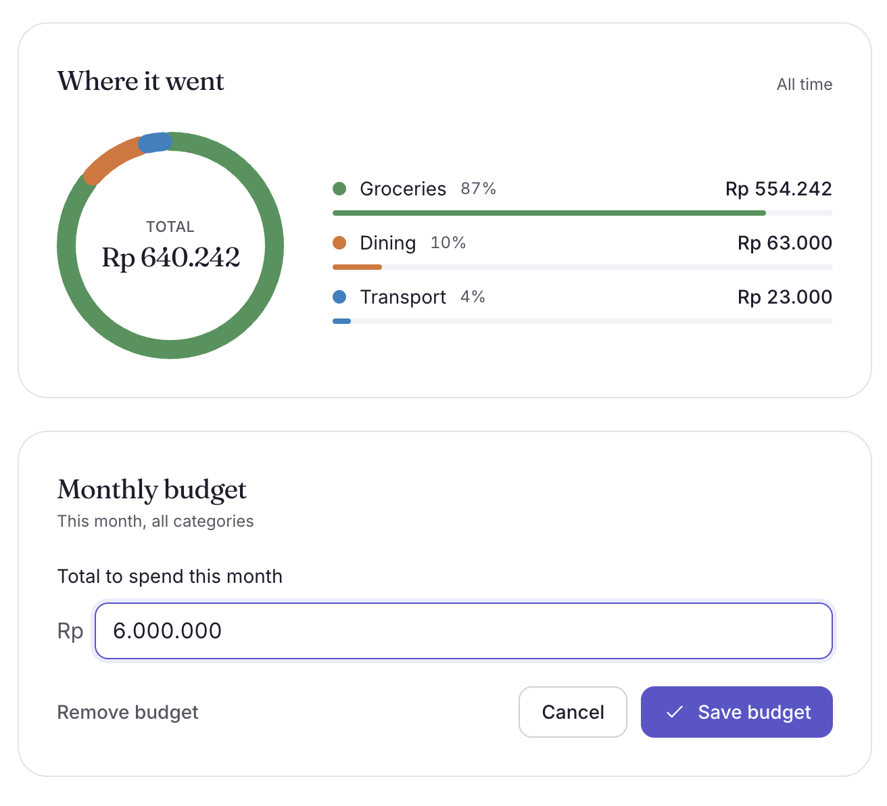
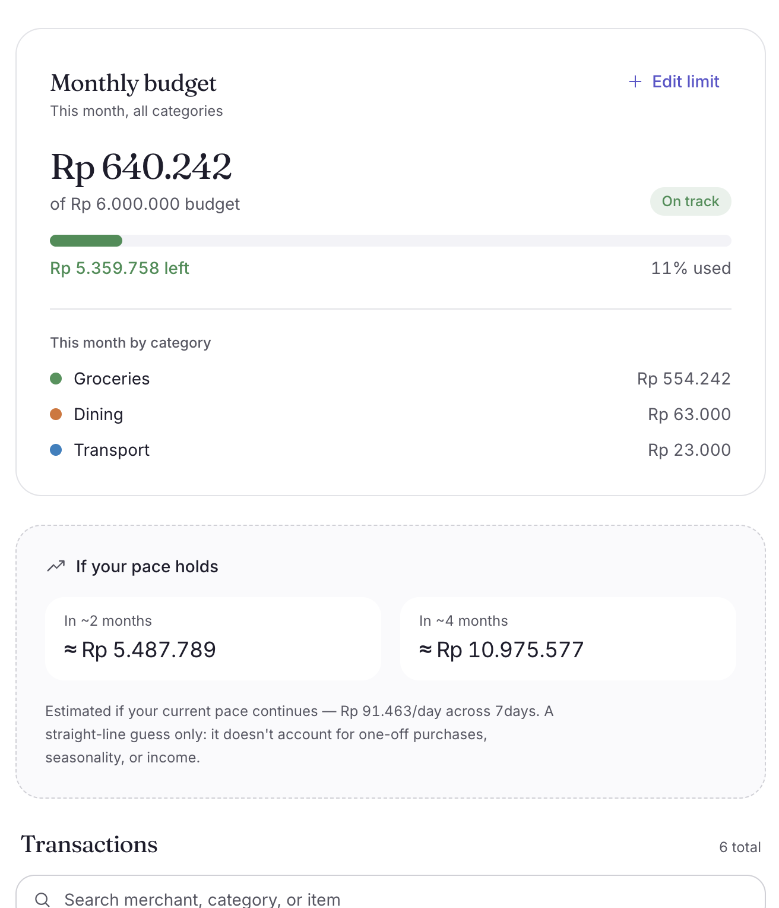
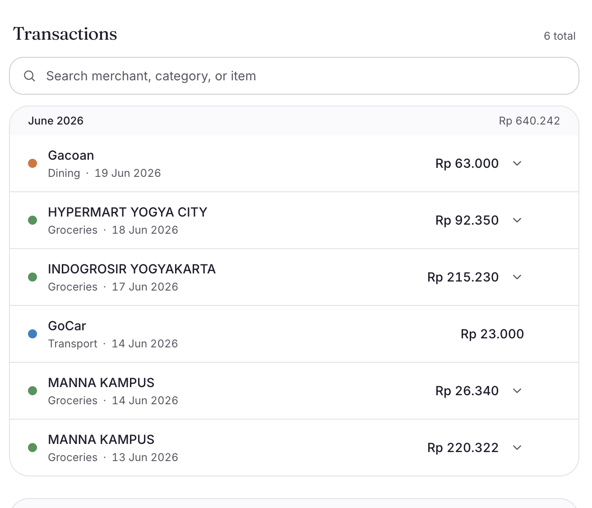
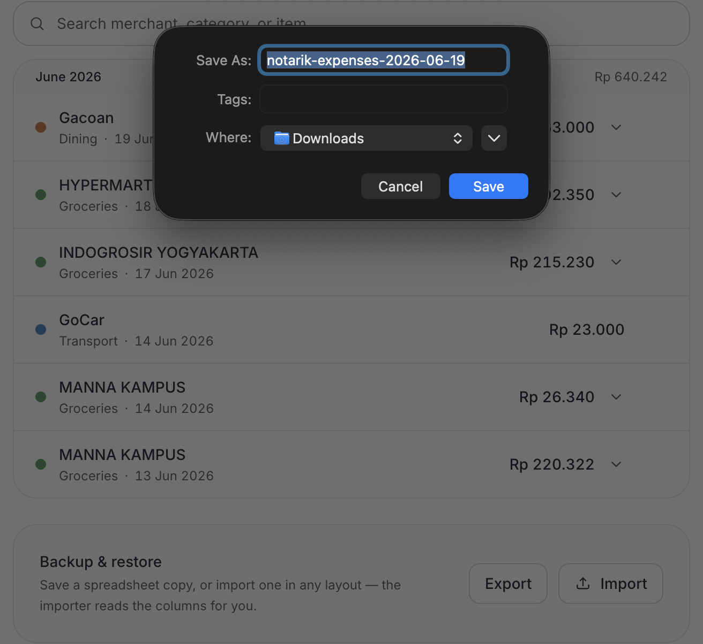

# Notarik — Snap a receipt, get an instant expense recap

> Take a photo of a receipt and it auto-extracts what you bought, the total, and the category — no more typing receipts into a spreadsheet one by one.

**Live demo:** https://notarik.vercel.app
**Repo:** https://github.com/nashirjamali/notarik

---

## What it is, and how to run it

Notarik turns a photo of a paper receipt into a structured, categorized expense entry, then keeps a running recap — a per-category chart, one total monthly budget, and a rough spend projection — that you can browse month by month, search, and back up to Excel. Data lives in the browser's local storage; the OpenRouter API key stays server-side.

**Run locally:**

```bash
git clone https://github.com/nashirjamali/notarik.git
cd notarik
npm install

# add your OpenRouter API key (used for receipt scanning and Excel import)
cp .env.example .env.local
# then edit .env.local and set OPENROUTER_API_KEY=your_key

npm run dev
# open http://localhost:3000
```

---

## Screens

### Add a receipt
Three ways in: take a photo, upload an image or PDF, or enter it by hand.



### Review & correct
Check the AI's read and fix the total, category, or items before saving.



### Manual entry
No photo needed — type the merchant, total, category, and line items.



### Recap
Per-category chart and totals, scoped to all time or a single month.



### Monthly budget
One total monthly limit — spent vs budget in IDR and %, with the per-category breakdown.



### Projection
A rough straight-line estimate of where the current pace is heading.



### Transactions
Month-grouped ledger with search and pagination; expand a row for its line items.



### Excel backup
Export everything to `.xlsx`, or import any layout back — AI maps the columns.



---

## Who it's for, and the one job it has to do well

For someone who wants to track spending but keeps giving up because typing every receipt into a spreadsheet is tedious — groceries and dining out have a dozen line items each, and forgotten receipts make the recap fall apart.

**The one job:** turn a receipt photo into a correct, categorized expense entry with as little typing as possible.

---

## Why this problem, and how I know it's worth solving

It's my own monthly pain: hoard the paper receipts, hand-type each one into Excel, then abandon it halfway. I hit this every single month — and budgeting friends hit the same wall. The data-entry step is what kills the habit.

---

## What's already out there, and why I built this anyway

Full budgeting and accounting apps do far more — bank sync, multi-account dashboards — but they're heavy to set up. My pain is narrow: manual entry from paper receipts. Notarik is the snap-and-done slice of that, with no account setup, plus the few extras I personally wanted (Excel backup, one budget, a rough projection).

---

## What I put in scope, what I left out, and why

**In:** add a receipt by photo, image/PDF upload, or manual entry; AI extraction (merchant, date, items, final total), auto-categorization, review & correct, per-category recap chart, monthly browsing with search + pagination, Excel export/import (AI maps any column layout on import), one total monthly budget, and a spend projection.

**Out:** **split bill** (a whole feature on its own — my #1 next item), **accounts/login/cloud sync** (local storage + Excel export is enough to prove it), and **multi-currency** (IDR only).

The bet is the core loop — photo → categorized expense — feeling good. Budget and projection only earned their place after that worked.

---

## Where I didn't have answers, what I assumed

- **Receipts vary** (faded thermal, crumpled, odd layouts) — assumed legible print, best-effort extraction, with the final total prioritized.
- **Subtotal vs total trap** — prompted the model specifically for the final payable amount, not the subtotal.
- **Categories** — a small fixed set rather than user-defined, to stay focused.
- **Projection** is a straight-line run-rate guess — labelled an estimate and hidden until there's enough data, so it never looks authoritative on three receipts.
- **Currency** — assumed IDR throughout.

---

## Three questions I'd ask a real user before building more

1. Do you trust the extracted total enough to just save it, or would you always glance and fix it?
2. Eating out with friends — do you want to split the bill *inside* Notarik, or just record your own share?
3. Do you care more about the recap and budget (where money goes) or the projection (where it's heading)?

---

## How I'd know it's working, and what I'd do next

**Working:** the extracted total is right often enough that I rarely correct it, and I keep logging receipts instead of quitting after a few — for an expense tool, becoming a habit is the real test.

**Next:** split bill (assign items to people, share tax/service); a faster correction flow; smarter budgeting (rollover, near-limit alerts); and a projection that separates recurring from one-off spend instead of a flat run-rate.
